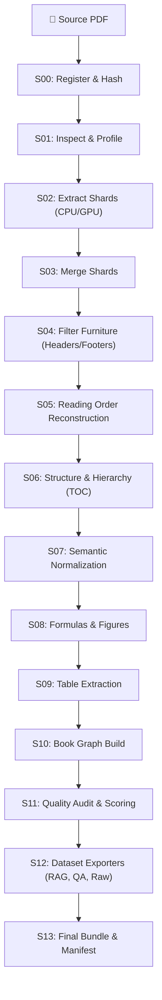

# 📚 DABOOK

> Compile any book-like document into a **traceable, validated, editable Book Graph**, then export that graph as ML-ready datasets (`raw` / `rag` / `llm` / `qa` / `code` / `cpt` / `table`) — resumable, multi-book, parallel, with a live localhost control room.

[](https://github.com/brovk2008/Dabook/actions/workflows/ci.yml)
[](https://github.com/brovk2008/Dabook/actions/workflows/codeql.yml)
[](LICENSE)
[](https://python.org)
[](https://github.com/astral-sh/ruff)
[](SECURITY.md)

---

## ⚡ Quick Start

```bash
# Install with uv (recommended) or pip
uv tool install dabook
# or: pip install dabook

# Process a book (runs supervisor, starts workers, launches dashboard)
dabook run my_book.pdf
```

The live control room dashboard automatically opens at **`http://127.0.0.1:8765`**.

To resume an interrupted run with **zero re-work**:
```bash
dabook resume
```

---

## 🌟 Key Features

- 🛡️ **Guaranteed Resumable:** `kill -9` or power loss at any instant; `dabook resume` picks up immediately with two-phase atomic filesystem commits.
- ⚡ **Zero-Redo Caching:** Pure content-addressed caching: identical PDF + configuration hash = instant no-op.
- 📚 **Multi-Book Parallelism:** Process batches of books concurrently with automatic worker throttling and memory guards.
- 🎛️ **Live Localhost Control Room:** Real-time WebSockets/SSE dashboard reporting live throughput (pages/sec), pool utilization, error logs, and ETA with uncertainty bands.
- 🔍 **Full Provenance Chain:** Every single sentence and token traces back through:
  $$\text{PDF} \longrightarrow \text{Page} \longrightarrow \text{BBox} \longrightarrow \text{Block} \longrightarrow \text{Node} \longrightarrow \text{Export Record}$$
- 📦 **Multiple ML Export Targets:** Export clean, specialized datasets:
  - `raw`: Continuous full-text with headings and structure metadata
  - `rag`: Semantic chunks bounded by section boundaries with breadcrumbs
  - `llm`: Pre-training / fine-tuning prompt-completion sequences
  - `qa`: Extracted QA pairs and reading comprehension items
  - `code`: Syntactically verified code blocks with programming language tags
  - `table`: Structured tables formatted as CSV, Markdown, and JSON
- 📝 **Human-Editable & Auditable:** Cleanly view extracted vs generated tokens; reapply human correction logs over re-compiled graphs.

---

## 🏗️ Architecture & Pipeline Stages



| Stage | Name | Worker Pool | Description |
|---|---|---|---|
| **S00** | `register` | `io` | Compute SHA256, verify PDF headers, initialize workspace |
| **S01** | `inspect` | `cpu` | Detect scanned vs born-digital pages, font tables, language |
| **S02** | `extract` | `cpu` / `gpu` | Sharded parallel extraction of text, bboxes, and images |
| **S03** | `merge` | `io` | Recombine sharded pages into a coherent document stream |
| **S04** | `furniture` | `cpu` | Detect and strip running headers, footers, and page numbers |
| **S05** | `order` | `cpu` | Reconstruct true column-aware, wrap-around reading order |
| **S06** | `structure` | `cpu` | Reconcile PDF bookmarks with font hierarchies and headings |
| **S07** | `normalize` | `cpu` | Unicode NFC normalization, hyphenation fixing, ligature repair |
| **S08** | `specialized` | `cpu` / `gpu` | LaTeX equation recovery, code extraction, figure cropping |
| **S09** | `tables` | `cpu` / `gpu` | Cell grid detection and table serialization (MD / HTML / CSV) |
| **S10** | `graph` | `cpu` | Construct canonical typed Book Graph IR with cross-references |
| **S11** | `audit` | `cpu` | Run heuristic validation checks, compute quality metrics |
| **S12** | `export` | `cpu` | Generate ML-ready dataset shards (`rag`, `llm`, `qa`, etc.) |
| **S13** | `bundle` | `io` | Validate final manifest, write SHA256 checksums, finalize output |

---

## 💻 CLI Commands

```bash
# Run a book or directory of books
dabook run ./books/ --profile balanced --modes raw,rag,qa

# Resume an interrupted workspace
dabook resume -w ./dabook_workspace

# View progress and status of active books and tasks
dabook status

# Inspect environment dependencies and system readiness
dabook doctor

# Inspect a generated Book Graph or stage artifact
dabook inspect <book_id> --stage s10_graph

# Inspect or garbage-collect workspace caches
dabook cache stats
dabook cache gc --older-than 7
```

---

## 🎯 Design Principles

1. **The block is the unit of meaning, never the page.** Page boundaries are printing artifacts; semantic blocks transcend pages.
2. **Deterministic first, AI second.** Fast regexes, font heuristics, and geometric bounding boxes run before costly neural models.
3. **Strict Source-Faithfulness.** Every generated token or summary is explicitly flagged; raw text is never discarded.
4. **Three Text Representations:** Always maintain `raw` (exact OCR/PDF glyphs) $\to$ `normalized` (fixed ligatures/hyphens) $\to$ `clean` (furniture stripped).
5. **Infrastructure before Intelligence.** Solid SQLite WAL state tracking, process leases, and atomic commits come before complex ML pipelines.

---

## 🤝 Contributing

We welcome contributions of all kinds! Whether you want to add new parsing backends, expand export formats, or improve performance, check out our guides:

- 📖 **[Contributing Guide](CONTRIBUTING.md):** Setup instructions, architectural walkthrough, coding style, and testing guidelines.
- 📜 **[Code of Conduct](CODE_OF_CONDUCT.md):** Contributor Covenant v2.1 standards.
- 🔒 **[Security Policy](SECURITY.md):** How to report vulnerabilities responsibly.
- 💬 **[Support Guide](SUPPORT.md):** How to get help and ask questions.

To get started with local development:

```bash
git clone https://github.com/brovk2008/Dabook.git
cd Dabook
uv venv --python 3.11
source .venv/bin/activate    # or .\.venv\Scripts\Activate.ps1 on Windows
uv pip install -e ".[dev]"
pytest
```

---

## ⚖️ License

Distributed under the **Apache License 2.0**. See [`LICENSE`](LICENSE) for details.
Optional third-party plugins or proprietary model weights have separate licenses (see documentation).
